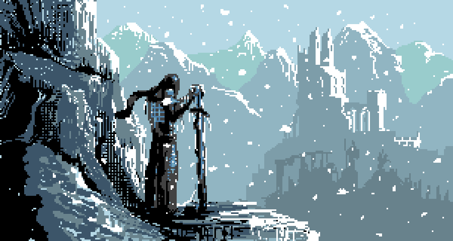

# Yohan Clark

### Análise e Desenvolvimento de Sistemas • Python • Cybersecurity

 

  

---

## 👨‍💻 Sobre Mim

Sou **Yohan Clark**, estudante de **Análise e Desenvolvimento de Sistemas** e formado como **Técnico em Informática**.

Tenho interesse em **desenvolvimento de software, Python, desenvolvimento web, redes de computadores, Linux e cibersegurança**.

Atualmente, estou focado em transformar meus estudos em projetos práticos, expandir meus conhecimentos e construir minha carreira na área de tecnologia.

---

## 🛠️ Tecnologias

  

---

## ⚙️ Ferramentas

---

## 🚀 Projetos

### 🌊 Espaço Tia Ju

Página web desenvolvida para o **Espaço Tia Ju**, com foco em apresentar o projeto de forma visual, organizada e acessível.

**Tecnologias:** HTML • CSS

🔗 **[Acessar projeto](COLOQUE_AQUI_O_LINK_DO_ESPACO_TIA_JU)**

---

### 🔐 Port Scanner

Ferramenta desenvolvida em **Python** para explorar conceitos de redes, portas e segurança.

**Tecnologias:** Python • HTML • CSS

🔗 **[Ver projeto no GitHub](COLOQUE_AQUI_O_LINK_DO_PORT_SCANNER)**

---

### 🌐 Projetos Web

Projetos desenvolvidos para praticar criação de interfaces, estrutura de páginas e desenvolvimento web.

**Tecnologias:** HTML • CSS • Python

---

### 🛡️ Cybersecurity

Projetos e experimentos voltados para aprendizado de **segurança da informação, redes e análise de segurança**.

**Tecnologias:** Python • Linux • Redes

---

## 🎓 Formação & Certificações

* 🎓 **Análise e Desenvolvimento de Sistemas** — Em andamento
* 💻 **Técnico em Informática** — ETEC Adolpho Berezin
* 🛡️ **Introdução à Cibersegurança** — Cisco Networking Academy
* 🌐 **Fundamentos de Redes** — Cisco Networking Academy
* 🐍 **Python** — Bradesco

---

## 📫 Contato

---

### Always learning. Always building.

 

